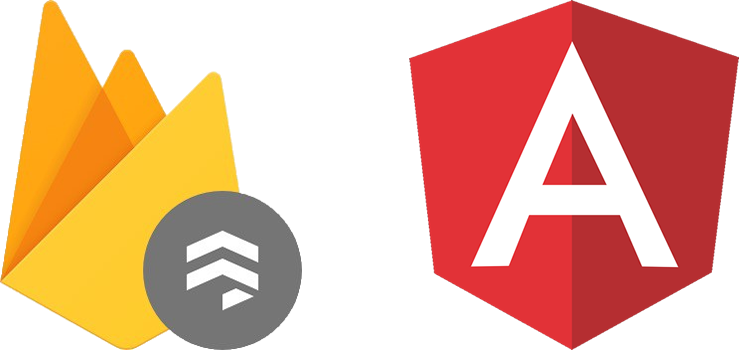

<!-- PROJECT LOGO -->
<br />
<p align="center">
  <a href="https://firebase.google.com">
    
  </a>

  <h3 align="center">ANGULARJS PROJECT WITH FIREBASE</h3>

  <p align="center">
    Angular WebApp
</p>


<!-- TABLE OF CONTENTS -->
## Table of Contents

* [About the Project](#about-the-project)
* [Getting Started](#getting-started)
  * [Prerequisites](#prerequisites)
  * [Installation](#installation)
* [Usage](#usage)
* [License](#license)


<!-- ABOUT THE PROJECT -->
## About The Project
This workshop will allow you to learn the basics of the Firebase database. 


<!-- GETTING STARTED -->
## Getting Started

### Prerequisites

> It's time to laugh.

* Create an account on Firebase https://firebase.google.com (with an gmail email)

* Install nodejs https://nodejs.org/en/download/

* Install NPM 
```sh
npm install -g npm@latest
```

* Install Angular/CLI 
```sh
npm install -g @angular/cli
```

* Link Angular with Firebase 

1. Grab your Firebase Web Config
    - From your Firebase project click the gear icon next to “Project Overview” to bring you to your project settings. On the general tab, in the *Your apps” section, click the </> button. This opens a popup called Add Firebase to your web app. You only need to copy the config object from this page.

2. Install @angular/fire
```sh
npm install firebase @angular/fire
```

3. Add @angular/fire to the App Module
```typescript
import { BrowserModule } from '@angular/platform-browser';
import { NgModule } from '@angular/core';
import { AppComponent } from './app.component';

// 1. Import the libs you need
import { AngularFireModule } from '@angular/fire';
import { AngularFirestoreModule } from '@angular/fire/firestore';
import { AngularFireStorageModule } from '@angular/fire/storage';
import { AngularFireAuthModule } from '@angular/fire/auth';

// 2. Add your credentials from step 1
const config = {
    apiKey: '<your-key>',
    authDomain: '<your-project-authdomain>',
    databaseURL: '<your-database-URL>',
    projectId: '<your-project-id>',
    storageBucket: '<your-storage-bucket>',
    messagingSenderId: '<your-messaging-sender-id>'
};

@NgModule({
  imports: [
    BrowserModule,
    // 3. Initialize
    AngularFireModule.initializeApp(config),
    AngularFirestoreModule, // firestore
    AngularFireAuthModule, // auth
    AngularFireStorageModule // storage
  ],
  declarations: [ AppComponent ],
  bootstrap: [ AppComponent ]
})
export class AppModule {}
```

Perfect. That should work now it's up to you guys. :+1:

<!-- USAGE EXAMPLES -->
### Instruction

* Create Project
```sh
ng new workshop_firebase
```

<!-- USAGE EXAMPLES -->
## Usage

* Deploy server local
```sh
ng serve
```   

<!-- LICENSE -->
## License

Distributed under the MIT License. See `LICENSE` for more information.
